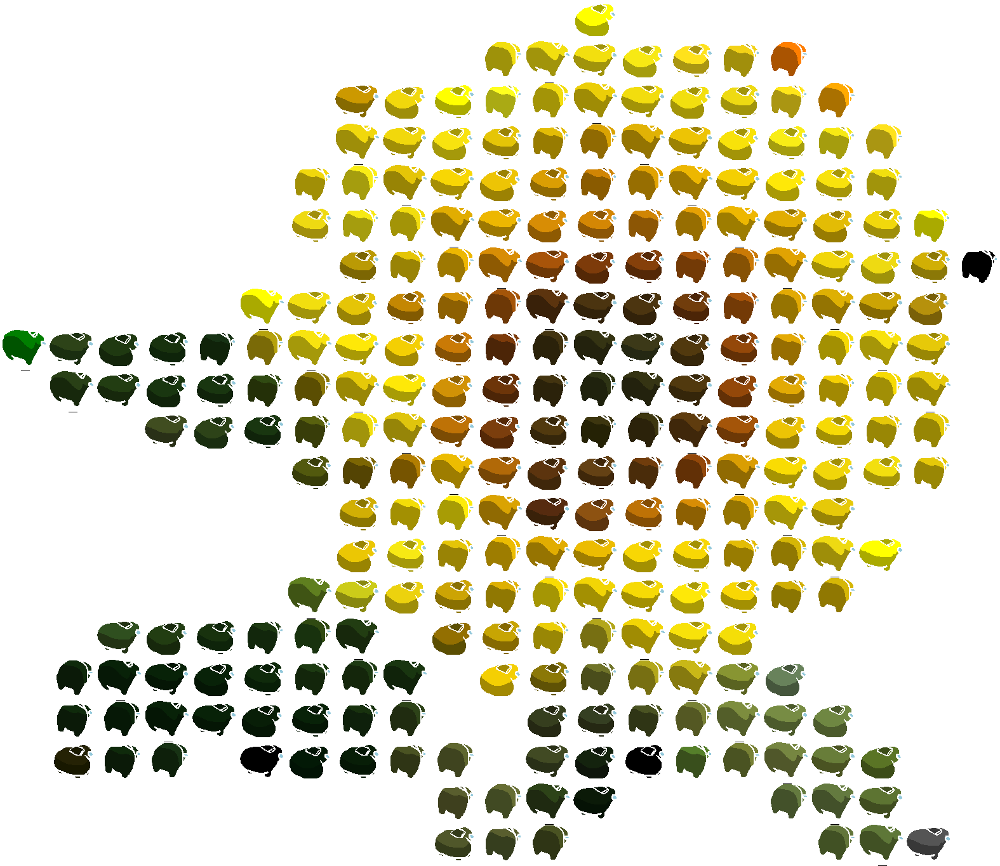

# About
A quickly hacked together script to generate an image out of the [Among Us twerk GIF](https://knowyourmeme.com/memes/among-us-twerk)
made into a Discord bot. Based on the [img_sussifier by LinesGuy](https://github.com/LinesGuy/img_sussifier).
With some minor improvements (transparency, configurable inputs, etc.)

This project is mostly just for fun.
If, for some reason, you need a more serious version of this project, check out
[https://github.com/ThatOneCalculator/Among-Us-Dumpy-Gif-Maker by ThatOneCalculator.](https://github.com/ThatOneCalculator/Among-Us-Dumpy-Gif-Maker)


## Example
A Suss-ed Sunflower, with transparency


# Deploying

## Make a Virtual Environment
```shell
python -mvenv venv
```

## Activate the Virtual Environment
```shell
source venv/bin/activate
```

## Install Requirements
```shell
pip install -r requirements.txt
```

## Create the Environment config file
```shell
cp .env.template .env
```

## Fill in the Fields in `.env`
You'll need to generate token
in [Discord's Developer Portal](https://discord.com/developers/applications)
and fill in the `Token` field.

The `DataDir` property is the path were images
will be saved/converted

## Run the Project
Be sure your virtual environment is activated (if you used one)
```shell
python ./main.py
```
